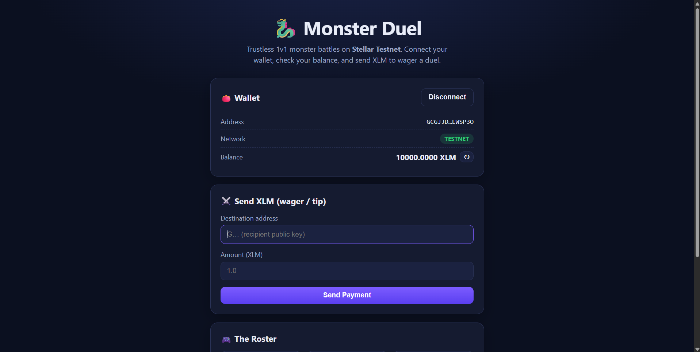
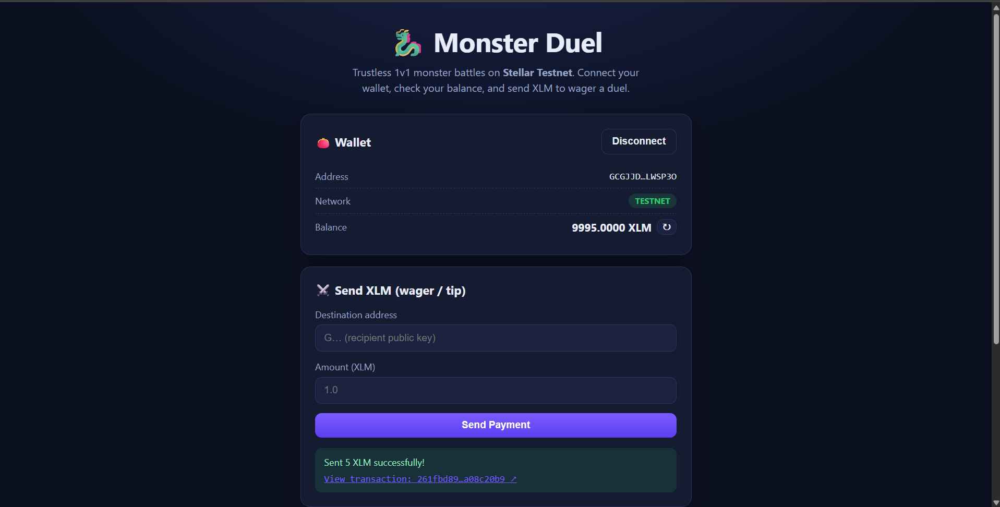

# 🐉 Monster Duel — Stellar dApp (MAD Level 1 · White Belt)

A React frontend for the **Monster Duel** project that runs on **Stellar
Testnet**. It connects the **Freighter** wallet, shows your XLM balance, and
lets you send an XLM payment with full transaction feedback — fulfilling all the
requirements of the **Monthly Builder Challenges – Level 1 (White Belt)**.

It is themed around our on-chain Monster Duel game contract and is the first
step toward the full battle UI.

---

## ✨ Features

- 🔌 **Connect / disconnect** the Freighter wallet (Stellar Testnet).
- 💰 **Fetch & display** the connected wallet's XLM balance (with refresh).
- ⚔️ **Send an XLM payment** to any address with a clear amount input.
- ✅ **Transaction feedback**: building / signing / submitting states, plus a
  success or failure message and a clickable **transaction hash** on
  stellar.expert.
- 🛟 Helpful states: detects when Freighter is missing, when the network is not
  Testnet, and when the account is unfunded (links to Friendbot).

---

## 🧱 Tech stack

- [React](https://react.dev/) + [Vite](https://vitejs.dev/)
- [@stellar/freighter-api](https://www.npmjs.com/package/@stellar/freighter-api) — wallet connection & signing
- [@stellar/stellar-sdk](https://www.npmjs.com/package/@stellar/stellar-sdk) — Horizon queries & transaction building

---

## 🚀 Run locally

### Prerequisites

- [Node.js](https://nodejs.org/) 18+ and npm
- [Freighter](https://www.freighter.app/) browser extension, set to **Testnet**

### Steps

```bash
# from the frontend/ folder
npm install
npm run dev
```

Open the printed URL (usually <http://localhost:5173>) in the browser where
Freighter is installed.

> **Get test XLM:** after connecting, if the account is unfunded, use the
> in-app Friendbot link or visit <https://friendbot.stellar.org>.

---

## 🕹️ How to use

1. Click **Connect Freighter** and approve the connection.
2. Make sure the **Network** badge shows `TESTNET` (switch in Freighter if not).
3. Your **balance** appears automatically; press ↻ to refresh.
4. Enter a **destination address** and **amount**, click **Send Payment**, and
   approve in Freighter.
5. On success you'll see a confirmation and a link to the transaction.

---

## 📸 Screenshots

**1. Wallet connected + balance displayed**

The wallet shows the connected address, the `TESTNET` network badge, and the
account's XLM balance.



**2. Successful testnet transaction (result shown to the user)**

After sending 5 XLM, the UI shows a success message with a clickable
transaction hash, and the balance updates (10000 → 9995 XLM).



---

## 🔗 Related

- On-chain duel contract (testnet): `CCRZGZLNJR4B2NQAR6EAAY3XPK5XNKDPLJYX55ZIB4AAEVIVN4DDS7TA`
- Smart contract source: see the [`contracts/monster-duel`](../contracts/monster-duel) folder.

## 📄 License

MIT
